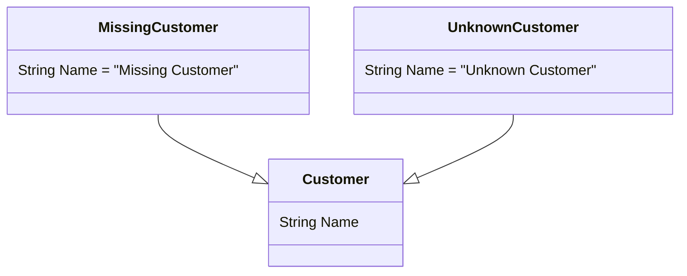
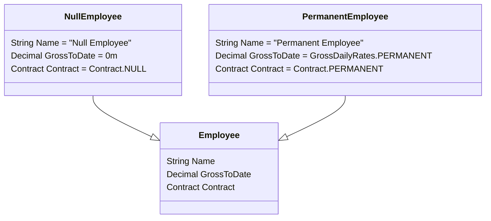

[](https://github.com/kaiosilveira/poeaa-registry/actions/workflows/dotnet.yml)

ℹ️ _This repository is part of my "Patterns of Enterprise Application Architecture" (PoEAA) catalog, based on Martin Fowler's book with the same title. For my full work on the topic, see [kaiosilveira/poeaa](https://github.com/kaiosilveira/patterns-of-enterprise-application-architecture)_

---

# Special Case

A subclass that provides special behavior for particular cases.



## Implementation example

Sticking to the book's example, our implementation contains a base `Employee` class responsible for holding basic information about employees, such as their name, contract type and gross salary.

## Implementation considerations

When working with the type of entity described above, we often find ourselves performing null checks, to make sure the employee we've got back from our persistence layer exists and is valid. In these cases, it's helpful to introduce a special case for particular situations, such as an employee being null. With that in mind, our class diagram for this example looks like the diagram below.



## Test suite

In a good [TDD](https://github.com/kaiosilveira/test-driven-development) fashion, unit tests were used to guide this implementation. Testing the `NullEmployee` implementation is straightforward and the full suite is shown below:

```csharp
public class NullEmployeeTests
{
  private readonly Employee employee;

  public NullEmployeeTests() => employee = new NullEmployee();

  [Fact]
  public void TestReturnsNullAsName() => Assert.Equal("Null Employee", employee.Name);

  [Fact]
  public void TestReturnsZeroGrossForThePeriod() => Assert.Equal(0m, employee.GrossToDate);

  [Fact]
  public void TestReturnsNullContractType() => Assert.Equal(Contract.NULL, employee.Contract);
}
```

Testing the `PermanentEmployee` class is also straightforward, we just need to make sure to cover the gross rate calculation correctly:

```csharp
public class PermanentEmployeeTests
{
    public readonly Employee employee;

    public PermanentEmployeeTests()
    {
        employee = new PermanentEmployee("John Doe");
    }

    [Fact]
    public void TestReturnsTheCorrectName() => Assert.Equal("John Doe", employee.Name);

    [Fact]
    public void TestReturnsPermanentGrossRateForThePeriod()
    {
        var grossToDate = GrossDailyRates.PERMANENT * 30 / DateTime.Now.Day;
        Assert.Equal(grossToDate, employee.GrossToDate);
    }

    [Fact]
    public void TestReturnsPermanentContractType()
    {
        Assert.Equal(Contract.PERMANENT, employee.Contract);
    }
}
```

The full test suites for both classes are available at [NullEmployeeTests.cs](./PoEAASpecialCase.Tests/test/employees/NullEmployeeTests.cs) and [PermanentEmployeeTests.cs](./PoEAASpecialCase.Tests/test/employees/PermanentEmployeeTests.cs).

## Implementation details

Let's now dive a little deeper into the implementation that satisfies the unit tests above.

### Abstract `Employee` class

As mentioned above, the base `Employee` class has some information about the `Name`, `Contract` type, and gross salary of an employee. The `GrossToDate` field is marked as virtual, so it can be overwritten by subclasses:

```csharp
public class Employee
{
  public string Name { get; set; }

  public Contract Contract { get; private set; }

  public virtual decimal GrossToDate { get; }

  public Employee(string name, Contract contract)
  {
    Name = name;
    Contract = contract;
  }
}
```

### `PermanentEmployee` implementation

The implementation for a permanent employee provides a pretty simple calculation for the gross salary, considering the running month period, and provides a `PERMANENT` contract type to the base constructor, alongside a `name` received as a parameter:

```csharp
public class PermanentEmployee : Employee
{
  public override decimal GrossToDate
  {
    get { return GrossDailyRates.PERMANENT * 30 / DateTime.Now.Day; }
  }

  public PermanentEmployee(string name) : base(name, Contract.PERMANENT) { }
}
```

### Special case: `NullEmployee`

Finally, the special case for a null employee is straightforward: it extends the base `Employee` class, providing "Null Employee" as the name and a `NULL` contract type. It also overrides the `GrossToDate`, returning a fixed `0`:

```csharp
public class NullEmployee : Employee
{
  public NullEmployee() : base("Null Employee", Contract.NULL) { }

  public override decimal GrossToDate { get { return 0m; } }
}
```

And that's all, now we don't have to perform any `null` checks, considering that the persistence layer returns a NullEmployee when it doesn't find a real one, for instance.
